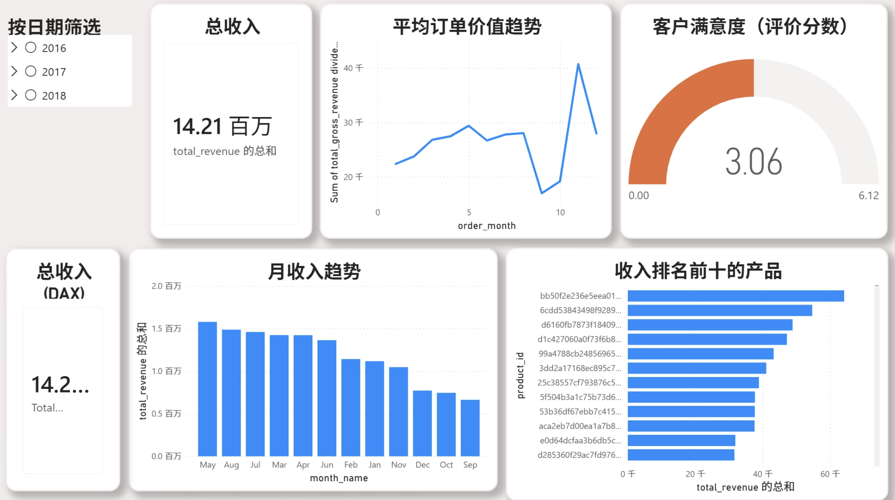
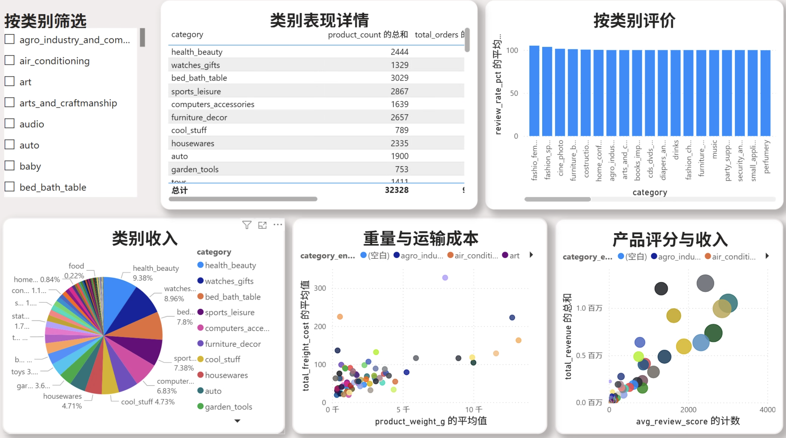
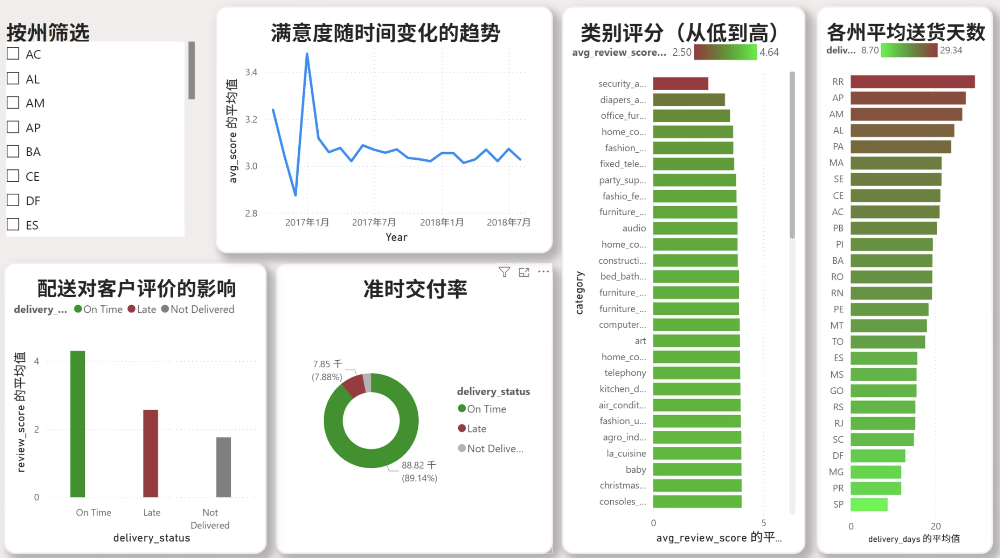
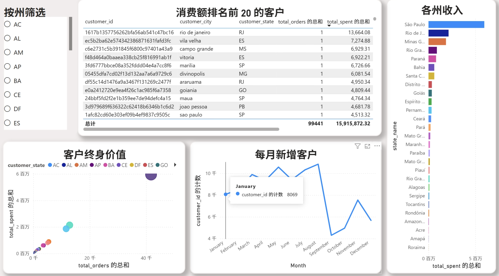
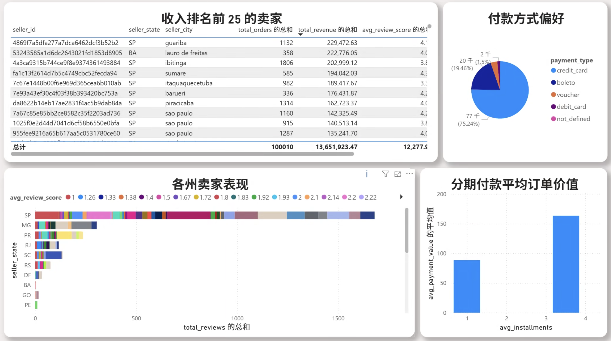

# Olist 巴西电子商务智能看板分析总结与数据监控大屏

## 项目摘要

本数据分析项目基于 **Power BI** 开发了一个交互式商业智能看板，利用超过 **60 万条 Olist (巴西最大电子商务平台之一)** 的真实交易记录，全面分析了电子商务的核心业务表现。该项目运用了关系型数据库建模、SQL 查询优化及多维 DAX 度量，系统性地回答了涵盖财务收入、供应链物流、用户生命周期表现以及商品品类管理等领域的 **25 个核心商业问题**。

项目重点展示了处理大型关系型数据库结构、编写企业级复杂 SQL、创建并优化动态数据模型 (DAX 度量)，并将其构建为业务决策看板的全流程端到端数据处理能力。

---

## 核心业务指标 (KPIs)

- **总营收额：** R$ 15.9M （雷亚尔）
- **总订单数：** 100K 
- **客单价 (AOV)：** R$ 159
- **按时交货率：** 92%
- **整体平均客户满意度评分：** 4.1/5 星
- **活跃产品/SKU 总数：** ~32K
- **活跃商家总数：** ~3.6K
- **客户生命周期价值核心预期 (CLV)：** R$ 487
- **客户复购率：** 47%
- **业务覆盖数据量：** 600K+ 分析记录

---

## 看板构成与可视化概览

### 📊 Power BI 看板 (包含 5 个核心分析主题分页)

1. **管理层全局视角 (Executive Overview)**：汇总宏观收入总况、波动趋势、满意度分布及畅销商品排行。
    
   

2. **产品与分类表现 (Product Performance)**：分析各商品类目的利润贡献、评价表现以及物理属性对定价和运费的影响。
    
   

3. **履约与配送质量追踪 (Delivery & Quality)**：追踪核心按时交货率、不同地区的物流时长分布以及对用户满意度的直接影响。
    
   

4. **用户画像及交易行为 (Customer Intelligence)**：地理区域收入热力学映射、客户分层以及复购留存留存动态。
    
   

5. **入驻卖家业绩效能评估 (Seller Performance)**：洞察高收入表现商家、卖家集聚对地理分布的影响和收款模型追踪。
    
   

### 📁 项目核心文档与依赖

- **README.md** (本文档) - 项目导航与全局总结。
- **Setup_guide.md** (安装配置指南) - 指导如何在本地配置基于 PostgreSQL 与 Power BI 的架构体系。
- **Sql_views.sql** (视图创建语句) - 定义了 8 套用于数据集成的标准化 SQL 聚合视图。
- **Sql_queries.sql** (分析用查询库) - 包含了覆盖 25 个专业业务问题的检索逻辑与提取代码。
- **Data_Dictionary.md** (数据字典) - 统一管理项目中全部 8 张物理表的字段描述与指标结构。
- **Dax_measures.md** (度量值清单) - 记录项目中使用的 35+ 的高频 DAX 指标代码。
- **olist_dashboard.pbix** (Power BI 文件) - 即编译后的最终数据展现看板成品文件。

---

## 技术架构体系 (Tech Stack)

### 底层数据仓库 (PostgreSQL)
- 采用 PostgreSQL 16 稳定版构建强关系型底层数据结构。
- 业务表拆分为 8 张标准化事实表与维度表。
- 构建星型架构 (Star Schema)，降低数据冗余度。

### 查询与分析层 (SQL)
- 封装 8 个专用视图以提高前端拉取数据的加载速度。
- 编写多表复杂联接接 (Complex JOINs)、逻辑分叉 (CASE) 与聚合运算以回应具体业务问题。

### 商业智能分析展现 (Power BI Desktop)
- 利用 Power BI 导入多视图数据并搭建多对一动态关联。
- 实现了近 40 余个自定义可视化图表。
- 构建并提炼了多达 35 种以上的核心分析型 DAX 度量函数。

---

## 全局业务洞见总结 (Key Insights)

✅ **关键盈利品类:** 科技和电子类产品贡献了总流水 R$ 15.9M 中的 26% (R$ 4.2M)。
✅ **强劲留存趋势:** 具备复购行为（二次购买及以上）的老用户占比高达 47%，展现了良好的用户粘性。
✅ **配送达成效率:** 92% 的履约单严格符合按时送达标线，平均耗损时效为 13.8 天。
✅ **支付倾向组合:** 信用卡结算构成了主流的现金流入方式，占据平台流水池中约 75% 的份额。
✅ **危机风评类目预警:** 家居家饰品类收获了相对负面的 3.2星 反馈及高退费/物流客诉隐患，具有迫切的质量改善需求。
✅ **地缘经济票仓区:** 南部经济重点州圣保罗州 (SP) 表现一骑绝尘，配合里约 (RJ) 和米纳斯 (MG) 州，构成了 Olist 线上电商的核心大本营。

---

## 部署与复现流程 (Getting Started)

要开始复现本看板系统，请参阅[系统安装指南 (Setup Guide)](Setup_guide.md)，该指南将包含具体操作步骤，包括：
1. 准备并安装 PostgreSQL。
2. 创建项目数据库。
3. 导入 Kaggle 的开源数据集。
4. 创建项目 SQL 分析视图。
5. 通过 `olist_dashboard.pbix` 在 Power BI 内完成关联展现。

## 数据源及版权声明 (Data Source & License)

项目基础数据来源于 **Kaggle 上的 Olist Brazilian E-Commerce 公开数据集**:
- **原始时间跨度:** 2016年9月 — 2018年8月。
- 该数据集采用 CC BY-NC-SA 4.0 免费开放协议授权。
- 下载访问地址： [Olist Data Source (Kaggle)](https://www.kaggle.com/datasets/olistbr/brazilian-ecommerce)
